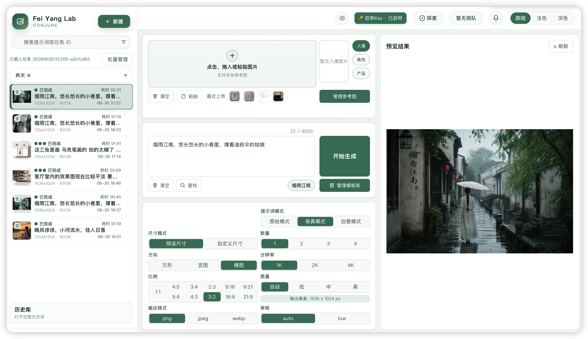

<h1 align="center">Fei Yang Lab</h1>

<p align="center">
  <sub>GPT-image-2 WebUI 工作台 · BYOK 自带密钥 · 多用户隔离 · 公共分享画廊 · Docker 部署</sub>
</p>

<p align="center">
  <a href="https://github.com/just-a-stone/gpt-image-lab/releases"></a>
  <a href="https://github.com/just-a-stone/gpt-image-lab/actions/workflows/ci.yml"></a>
  <a href="https://github.com/just-a-stone/gpt-image-lab/commits/main"></a>
  <a href="https://github.com/just-a-stone/gpt-image-lab/stargazers"></a>
</p>

<p align="center">
  
  
  
  
  
  
</p>

<p align="center">
  中文 · <a href="README.en.md">English</a>
</p>

<p align="center">
  
</p>

<p align="center"><sub>👆 WebUI 工作台主界面 · 任务队列 · 实时预览 · 多图画廊</sub></p>

---

## 简介

Fei Yang Lab（飞羊实验室）是基于 [iLab GPT Conjure](https://github.com/kadevin/ilab-gpt-conjure) 的增强分支，面向 GPT-image-2 的 AI 图片生成 WebUI 工作台，同时提供 CLI 便于本地自动化。

在上游功能基础上，本分支新增了：

- **BYOK 自带密钥**：用户可在浏览器中配置自己的 OpenAI 兼容 API Key、Base URL 和图像模型，无需在服务器端预设。
- **多用户数据隔离**：任务、参考图、画廊条目按用户隔离，互不可见；身份基于随机 Cookie，重启后自动恢复。
- **公共分享画廊**（`/explore`）：用户可将任务分享到公开画廊，任何人可浏览、查看多图画廊、复制提示词。
- **Docker 一键部署**：内置 Dockerfile 和 docker-compose.yml，支持多用户共享部署。
- **SSE 心跳保活**：适配 Docker / 反向代理环境，避免长连接超时断开。
- **环境变量管控**：`WEBUI_OWNER_SECRET`（身份密钥）、`WEBUI_DISABLE_DELETION`（禁用删除）、`CODEX_IMAGE_REQUEST_TIMEOUT_SECONDS`（请求超时）等。

## 界面预览

| 中文界面 | English UI |
|:---:|:---:|
|  |  |

<details>
<summary>📸 更多截图</summary>

- 顶部主界面：任务队列 + 实时进度 + 结果预览（见上方首页大图）。
- 提示词编辑器：`@` 图库 chip、`#` 颜色 chip、`~` 提示词片段 chip 三种原子插入。
- 图像编辑器：多图层组合、默认锁定比例变换、Shift 自由变换、局部擦除。
- `/explore` 公共分享画廊：无限滚动、多图模态框、一键复制提示词。
- `/history` 历史页：SQLite 分页、搜索、筛选、网格/列表视图。

</details>

## 功能

### 上游功能（完整保留）

- 面向 GPT-image-2 的文生图、参考图生成和图像编辑工作流。
- 支持 Codex Image、Codex Responses 和 OpenAI 兼容 API 接入。
- 多任务并发、本地队列状态、分页历史库、缩略图和结果归档。
- 独立 `/history` 页面支持 SQLite 分页、搜索、筛选、网格/列表视图和懒加载详情。
- 单任务多图输出、部分失败处理和失败重试。
- 公用图库、最近参考图、颜色 chip、提示词片段 chip 和提示词模板。
- 图像编辑器支持多图层组合、默认锁定比例变换、Shift 自由变换、局部擦除。
- 系统设置支持 13 种语言，首次启动自动跟随浏览器语言。
- CLI 支持生成、参考图、图像编辑、mask 和 dry-run。

### 本分支新增

- **BYOK 自带密钥**：前端弹出框输入 API Key / Base URL / 图像模型，存储在浏览器 `localStorage`，提交时随表单发送，服务端不持久化。
- **多用户隔离**：每个用户获得随机 `owner_id`（HMAC 签名 Cookie，30 天有效）；任务索引、画廊、参考图均按 `owner` 字段隔离；SSE 事件、图片路由、API 端点均强制 owner 校验。
- **公共分享画廊**（`/explore`）：
  - 任务卡片"分享"按钮 → 确认对话框（可编辑分享备注）→ 生成 `share_id`。
  - 已分享任务的分享按钮自动隐藏。
  - `/explore` 页面支持无限滚动、多图画廊模态框（上一张/下一张、缩略图条、键盘方向键）、复制提示词。
  - 分享数据使用独立 `shared_tasks` 表，`public_author_id` 经 HMAC 脱敏，响应为允许列表（仅暴露 `share_id`、`prompt`、参数、输出 URL 等公开字段）。
- **Docker 部署**：`Dockerfile` + `docker-compose.yml`，数据卷映射到 `./data`，内置健康检查。
- **SSE 心跳保活**：每 15 秒发送心跳注释，适配 Docker / Nginx 等中间代理。
- **BYOK 图像模型修复**：BYOK 设置中的图像模型现在真正生效（之前被默认值 `gpt-image-2` 覆盖）。
- **CLI 迁移工具**：`migrate_legacy.py`（将无主任务绑定到指定用户）、`strip_byok_keys.py`（清除历史持久化的 BYOK Key）。

## 认证模式

### BYOK 自带密钥（本分支新增）

点击界面右上角"自带密钥"按钮，填入你的 OpenAI 兼容 API Key、Base URL（如 `https://api.openai.com/v1`）和图像模型名（如 `dall-e-3`、`gpt-image-2`）。凭据仅存在浏览器 `localStorage`，提交时随表单发送到服务端，服务端仅在任务执行期间暂存于内存，不写入数据库或日志。

### OpenAI 兼容 API（上游功能）

在系统设置中配置 API 供应商卡片（Base URL、API Key、模型名、调用方式、并发上限）。适合稳定集成和团队使用。

### 高级本机 OAuth：Codex / ChatGPT

可选复用本机 Codex / ChatGPT OAuth 登录态，调用 ChatGPT 内部后端接口。仅面向个人本机工作流，接口可能随时变更。

## 环境要求

- Python 3.11 或更高版本。
- WebUI 依赖见 `requirements-webui.txt`。
- 修改 TypeScript 或 CSS 时需要 `package.json` 中的前端工具（esbuild + Konva）。
- Docker 部署需要 Docker 20.10+ 和 Docker Compose V2。

## 快速开始

### 方式一：Docker 部署（推荐多用户场景）

```bash
git clone https://github.com/just-a-stone/gpt-image-lab.git
cd gpt-image-lab

# 生成身份密钥（多用户必须固定，否则重启后所有人需重新建立会话）
echo "WEBUI_OWNER_SECRET=$(openssl rand -hex 32)" > .env

# 按需编辑 docker-compose.yml 中的环境变量
docker compose up -d
```

然后打开 `http://localhost:8787/`。

数据（输入/输出/画廊/设置/任务数据库）持久化在 `./data/` 目录。

### 方式二：本地源码运行

```bash
git clone https://github.com/just-a-stone/gpt-image-lab.git
cd gpt-image-lab
python3 -m venv .venv
.venv/bin/python -m pip install -r requirements-webui.txt

.venv/bin/python -m uvicorn codex_image.webui.app:app --host 127.0.0.1 --port 8787 --no-access-log
```

然后打开 `http://127.0.0.1:8787/`。

### 方式三：一键启动脚本

macOS：双击 `Start WebUI.command`
Windows：双击 `Start WebUI.bat`

## 环境变量

| 变量 | 说明 | 默认值 |
| --- | --- | --- |
| `WEBUI_OWNER_SECRET` | 用户身份 Cookie 的 HMAC 签名密钥。多用户部署**必须固定**，否则重启后所有用户失去会话。用 `openssl rand -hex 32` 生成。 | 随机（重启失效，打印警告） |
| `WEBUI_DISABLE_DELETION` | 设为 `1`/`true`/`yes`/`on` 禁用删除/归档功能。多用户共享部署建议开启。 | 空（允许删除） |
| `CODEX_IMAGE_REQUEST_TIMEOUT_SECONDS` | 单次生图请求超时秒数。 | 300 |
| `CODEX_IMAGE_DEBUG_SSE` | SSE 调试日志，生产环境留空。 | 空 |

## 多用户隔离

本分支实现了完整的用户级数据隔离：

- **身份**：首次访问时生成随机 `owner_id`（如 `u_a1b2c3d4e5f6...`），通过 HMAC 签名的 Cookie 持久化，30 天有效。
- **恢复**：Cookie 丢失后，可通过 `key_hash`（基于浏览器指纹的恢复锚点）重新关联已有数据。
- **隔离范围**：
  - 任务索引（`task_index` 表 `owner` 列）
  - 画廊条目（`gallery_items` 按 owner 过滤）
  - 参考图资产（`reference_assets` 按 owner 过滤）
  - SSE 事件流（仅推送当前 owner 的任务事件）
  - 图片路由（`/api/outputs/`、`/api/inputs/` 校验文件归属）
- **共享资源**：画廊分类、提示词片段、提示词模板仍为全局共享（模板设计为可复用结构）。

### CLI 迁移工具

```bash
# 将无主任务（owner 为空）绑定到指定用户
.venv/bin/python -m codex_image.webui.migrate_legacy --owner u_xxxx --db output/webui-outputs/source-data/webui-task-index.db

# 清除历史任务参数中残留的 BYOK API Key（旧版本可能持久化了）
.venv/bin/python -m codex_image.webui.strip_byok_keys --db output/webui-outputs/source-data/webui-task-index.db
```

## 公共分享画廊

访问 `/explore` 浏览所有公开分享的任务。

- **分享**：在任务列表点击"分享"按钮 → 确认对话框 → 任务出现在公共画廊。
- **取消分享**：再次点击已分享任务的"取消分享"按钮。
- **浏览**：`/explore` 页面支持无限滚动、多图画廊模态框（方向键翻页）、一键复制提示词。
- **安全**：分享使用独立 `share_id`（非 task_id），响应仅包含允许公开的字段；`public_author_id` 经 HMAC 脱敏；图片设置 5 分钟缓存（取消分享后最多 5 分钟生效）。

## WebUI 使用说明

1. **认证**：在顶部选择认证来源（BYOK / Codex / API），或在右上角点击"自带密钥"配置 BYOK。
2. **API 设置**：打开系统设置维护 API 供应商卡片、Codex 通道、界面语言、存储目录和通知偏好。
3. **参考图**：支持上传、拖拽、粘贴、最近上传和公用图库。
4. **提示词**：可直接输入文本，也可插入 `@` 图库 chip、`#` 颜色 chip、`~` 提示词片段 chip。
5. **参数**：设置数量、尺寸、方向、质量、输出格式和压缩率。
6. **生成**：点击开始生成，在左侧任务列表查看进度，在右侧预览区查看、精选、重试、下载、打包或归档结果。
7. **历史**：完整历史在 `/history` 中搜索和筛选。
8. **分享**：点击任务卡片"分享"按钮将作品分享到 `/explore` 公共画廊。

## 三种 chip

提示词编辑器支持三种原子 chip：

- `@` 图库 chip：搜索公用图库，将选中的图片同步加入参考图输入。
- `#` 颜色 chip：插入十六进制颜色值（如 `#FF6600`）。
- `~` 提示词片段 chip：用短标签插入常用提示词片段，提交时展开为完整内容。

## CLI

```bash
.venv/bin/python -m codex_image generate --prompt "A clean product photo of a ceramic mug" --out output/mug.png
```

更多参数请使用 `--help`。

## 开发

```bash
# 运行测试
PYTHONPATH=. .venv/bin/python -m pytest tests/ -v

# 前端检查
npm run check:webui
```

修改前端 TypeScript 或 CSS 时，先运行 `npm install` 安装构建依赖，再提交生成后的浏览器资源 `codex_image/webui/static/`。

修改 `explore.js` / `explore.css` / `explore.html` 不需要构建步骤（静态服务）。

### 项目结构（本分支新增文件）

```
codex_image/webui/
├── owner.py              # 用户身份核心：HMAC Cookie, OwnerStore
├── share_store.py        # shared_tasks 表 CRUD + 游标分页
├── feature_flags.py      # 环境变量特性开关
├── migrate_legacy.py     # CLI: 迁移无主任务
├── strip_byok_keys.py    # CLI: 清除持久化的 BYOK Key
├── routes/
│   ├── share.py          # 分享 CRUD + 公共画廊 API
│   ├── assets.py         # 归属校验的图片路由
│   └── session.py        # 会话/身份路由
├── frontend/src/
│   ├── byok.ts           # BYOK 前端 UI
│   └── share-dialog.ts   # 分享确认对话框
└── static/
    ├── explore.html      # 公共画廊页面
    ├── explore.css       # 画廊样式
    └── explore.js        # 画廊交互（无限滚动、多图模态框）
```

## 与上游的关系

本项目 Fork 自 [kadevin/ilab-gpt-conjure](https://github.com/kadevin/ilab-gpt-conjure)，在上游 AGPL-3.0 许可下继续开发。上游的免安装一键包、Release 打包流程、微信联系方式等不适用于本分支。

## 许可证

本项目采用 GNU AGPLv3 协议。详见 `LICENSE`。

如果你修改本软件，并通过网络向用户提供服务，需要按照 AGPLv3 要求开放对应源码。
